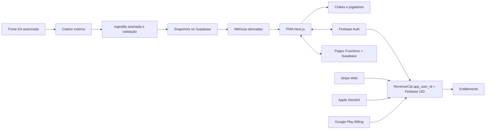

# Arquitetura

## Visão geral

O repositório contém normalização/importação, fila de clubes, snapshots de
partidas, reconciliador de Friendly, métricas e PWA. O coletor recorrente que
acessa a EA é externo e só deve ser ativado com autorização compatível.

## Stack

- Next.js 16 App Router;
- React 19 e TypeScript;
- Recharts para visualizações;
- Zod disponível para evolução da validação;
- Outfit para títulos, Inter para leitura e sistema visual mobile-first;
- manifesto e service worker para instalação PWA.
- tema escuro, sidebar desktop e menu inferior mobile.
- Firebase Auth somente para Google/e-mail. Perfis, vínculos de clube,
  amistosos, mercado e lobby ficam no PostgreSQL do Supabase, acessado apenas
  pelas Pages Functions após validar o token Firebase.
- RevenueCat planejado como fonte de verdade de assinaturas; Stripe cobra na
  Web e as lojas nativas cobrarão nos apps. O Firebase UID será o `app_user_id`.

## Rotas

- `src/app/page.tsx`: landing pública de aquisição;
- `src/app/inicio/page.tsx`: home exclusiva da sessão autenticada;
- `src/app/buscar/page.tsx`: busca global;
- `src/app/clubes/page.tsx`: diretório de clubes;
- `src/app/jogadores/page.tsx`: diretório de jogadores;
- `src/app/club/[id]/page.tsx`: painel de um clube;
- `src/app/jogador/[id]/page.tsx`: perfil individual;
- `src/app/amistosos/page.tsx`: mural comunitário;
- `src/app/partidas/page.tsx`: histórico e amistosos;
- `src/app/partidas/historico/page.tsx`: resultados públicos;
- `src/app/partidas/amistosos/page.tsx`: criação e aceite de desafios;
- `src/app/partida/[id]/page.tsx`: página individual e lobby;
- `src/app/[locale]/comunidade/[country]/page.tsx`: comunidades regionais;
- `src/app/entrar`, `criar-conta`, `recuperar-senha`: autenticação;
- `src/app/mercado/page.tsx`: mercado de transferências;
- `src/app/cadastro/page.tsx`: entrada de times por URL EA;
- `src/app/rankings/[metric]/page.tsx`: quatro rankings esportivos;
- `src/app/rankings/jogadores/[metric]/page.tsx`: rankings exclusivos de atletas;
- `src/app/rankings/clubes/[metric]/page.tsx`: rankings exclusivos de clubes;
- `src/app/rankings/times/page.tsx`: clubes cadastrados e validados na comunidade;
- `src/app/api/health/route.ts`: saúde da aplicação;
- `src/app/manifest.ts`: metadados de instalação.

## Fluxo atual de dados

1. Snapshots normalizados são preparados a partir da fonte pública.
2. `scripts/import-normalized.mjs` verifica a estrutura mínima, o clube e IDs de
   partidas duplicados.
3. O snapshot é salvo em `src/data/club.json`.
4. `src/lib/public-data.ts` adapta os clubes e jogadores dos snapshots
   globais enriquecidos versionados.
5. `src/lib/stats.ts` combina carreira e partidas sem duplicar totais oficiais.
6. Server Components carregam os snapshots e entregam os dados aos componentes.
7. Componentes client-side renderizam busca, filtros, formulários e gráficos.
8. `src/lib/friendlies-data.ts` prepara snapshots compactos de times, elencos e
   estatísticas para convites e desafios abertos.
9. `src/lib/community-service.ts` envia o token Firebase às Pages Functions; o
   backend valida a identidade e persiste no Supabase com autorização por perfil,
   vínculo e função.
10. Partidas realizadas entram em `ea_crawl_queue`; URLs oficiais enviadas por
    participantes também priorizam essa fila.
11. O endpoint interno assinado grava `ea_match_snapshots` deduplicados e chama
    `reconcile_ea_friendly`, que confirma o placar sem entrada manual.

## Limites atuais

- o importador está temporariamente restrito ao clube `171630`;
- não há coletor/agendador da EA ativado sem autorização da fonte;
- o endpoint de saúde mede banco, fila, última ingestão e idade do último dado;
- o service worker usa estratégia simples network-first e exige evolução antes
  de um grande volume de rotas dinâmicas.
- contas de serviço nunca entram no cliente; o frontend usa apenas a
  configuração pública do aplicativo Web Firebase.
- o deploy Pages usa `output: export`, perfis pré-renderizados e fallback estático
  para URLs criadas pela comunidade.
- o cliente nunca recebe a chave de serviço do Supabase e nunca pode alterar
  entitlements diretamente.

## Direção para múltiplos clubes

O armazenamento futuro deve ser particionado por `platform + clubId`, manter
snapshots imutáveis por coleta e publicar uma visão atual por clube. Jogadores
devem ser vinculados ao clube e à temporada para evitar colisões de nomes.
