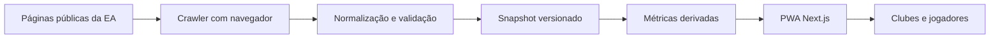

# Arquitetura

## Visão geral

O repositório atualmente contém a camada de normalização/importação, snapshot,
métricas e PWA. O serviço recorrente de crawl ainda é um item planejado.

## Stack

- Next.js 16 App Router;
- React 19 e TypeScript;
- Recharts para visualizações;
- Zod disponível para evolução da validação;
- Outfit para títulos, Inter para leitura e sistema visual mobile-first;
- manifesto e service worker para instalação PWA.
- tema claro/escuro, sidebar desktop e menu inferior mobile.

## Rotas

- `src/app/page.tsx`: home e destaques;
- `src/app/buscar/page.tsx`: busca global;
- `src/app/clubes/page.tsx`: diretório de clubes;
- `src/app/jogadores/page.tsx`: diretório de jogadores;
- `src/app/club/[id]/page.tsx`: painel de um clube;
- `src/app/jogador/[id]/page.tsx`: perfil individual;
- `src/app/amistosos/page.tsx`: mural comunitário;
- `src/app/partidas/page.tsx`: histórico e amistosos;
- `src/app/partidas/historico/page.tsx`: resultados públicos;
- `src/app/partidas/amistosos/page.tsx`: criação e aceite de desafios;
- `src/app/partida/[id]/page.tsx`: página individual e lobby;
- `src/app/[locale]/comunidade/[country]/page.tsx`: comunidades regionais;
- `src/app/entrar`, `criar-conta`, `recuperar-senha`: autenticação;
- `src/app/mercado/page.tsx`: mercado de transferências;
- `src/app/cadastro/page.tsx`: entrada de times por URL EA;
- `src/app/rankings/[metric]/page.tsx`: quatro rankings esportivos;
- `src/app/rankings/jogadores/[metric]/page.tsx`: rankings exclusivos de atletas;
- `src/app/rankings/clubes/[metric]/page.tsx`: rankings exclusivos de clubes;
- `src/app/rankings/times/page.tsx`: clubes cadastrados e validados na comunidade;
- `src/app/api/health/route.ts`: saúde da aplicação;
- `src/app/manifest.ts`: metadados de instalação.

## Fluxo atual de dados

1. Snapshots normalizados são preparados a partir da fonte pública.
2. `scripts/import-normalized.mjs` verifica a estrutura mínima, o clube e IDs de
   partidas duplicados.
3. O snapshot é salvo em `src/data/club.json`.
4. `src/lib/public-data.ts` adapta 552 clubes e 8.111 jogadores dos snapshots
   globais enriquecidos versionados.
5. `src/lib/stats.ts` combina carreira e partidas sem duplicar totais oficiais.
6. Server Components carregam os snapshots e entregam os dados aos componentes.
7. Componentes client-side renderizam busca, filtros, formulários e gráficos.
8. `src/lib/friendlies-data.ts` prepara snapshots compactos de times, elencos e
   estatísticas para convites e desafios abertos.

## Limites atuais

- o importador está temporariamente restrito ao clube `171630`;
- cadastro, mercado e mural usam `localStorage`; a identificação do mural é
  funcional no navegador, mas ainda não é autenticação segura ou sincronizada;
- não há agendador/crawler de produção no repositório;
- o endpoint de saúde verifica a aplicação, não a atualização da fonte;
- o service worker usa estratégia simples network-first e exige evolução antes
  de um grande volume de rotas dinâmicas.
- Firebase Auth funciona de verdade somente quando as variáveis públicas do
  aplicativo Web estão configuradas; contas de serviço nunca entram no cliente.
- o deploy Pages usa `output: export`, perfis pré-renderizados e fallback estático
  para URLs criadas pela comunidade.

## Direção para múltiplos clubes

O armazenamento futuro deve ser particionado por `platform + clubId`, manter
snapshots imutáveis por coleta e publicar uma visão atual por clube. Jogadores
devem ser vinculados ao clube e à temporada para evitar colisões de nomes.
