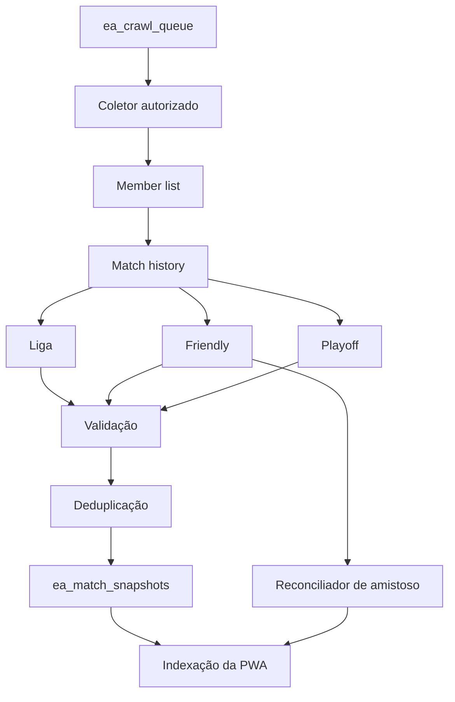

# Crawler e operação

## Escopo

O produto foi definido para coleta de páginas públicas, sem API privada e sem
contornar autenticação, CAPTCHA ou controles de acesso. Playwright é a opção
preferida porque as páginas da EA são renderizadas no cliente; Firecrawl pode
ser usado como fallback de leitura quando conseguir preservar o conteúdo
necessário.

O arquivo `scripts/download_by_club_id.py`, recebido no commit de dados
`3f974173`, acessa endpoints HTTP da EA dentro do navegador. Ele não representa
o crawler de produção aprovado e não é executado pela aplicação. Sua presença é
mantida para rastreabilidade do snapshot importado.

## Pipeline implantado

## Etapas de uma coleta

1. Validar `clubId` numérico e plataforma permitida.
2. Consultar `robots.txt` e regras aplicáveis antes da execução.
3. Abrir Overview e aguardar um elemento semântico que identifique o clube.
4. Extrair identidade, resumo e URL do escudo.
5. Abrir Member List, percorrer a lista completa e normalizar números/locales.
6. Abrir Match History e coletar separadamente Liga, Friendly e Playoff.
7. Expandir detalhes de cada partida quando a interface disponibilizar.
8. Validar esquema, intervalos e integridade referencial.
9. Comparar com o último snapshot; publicar somente se válido.
10. Registrar duração, páginas coletadas, alterações e erros sem guardar cookies.

## Robustez

- Preferir texto, papéis acessíveis e relações de conteúdo a classes CSS
  ofuscadas.
- Detectar página vazia, clube inexistente e bloqueio como estados diferentes.
- Aplicar timeout, retentativas com backoff e jitter.
- Limitar concorrência por host; sugestão inicial conservadora: uma página por
  vez e intervalo entre clubes, ajustado após observar a resposta da fonte.
- Não apagar snapshot válido quando uma execução falhar.
- Guardar amostra sanitizada do HTML somente para depuração e por prazo curto.
- Alertar quando campos obrigatórios desaparecem ou o volume varia de forma
  anormal.

## Validações mínimas

- `club.id`, `club.name`, `platform` e `sourceUrl` presentes;
- totais inteiros não negativos;
- percentuais entre 0 e 100;
- OVR em intervalo plausível e marcado como observado;
- placares inteiros não negativos;
- IDs de partida únicos;
- clube consultado presente como casa ou visitante;
- soma de gols individuais tratada como sinal de alerta, não como regra rígida,
  porque a fonte pode omitir atletas ou registrar gol contra.

## Agendamento recomendado

- clubes ativos: coleta periódica configurável;
- histórico Friendly aguardando confirmação: prioridade maior por janela curta;
- clubes inativos: frequência reduzida;
- reprocessamento manual após mudança de parser;
- cache e ETag/Last-Modified quando a fonte fornecer suporte.

A fila, snapshots, submissões de URL, ingestão assinada e reconciliação estão
implantados no Supabase. O coletor/agendador que abre páginas da EA permanece
desativado até existir autorização compatível com as regras publicadas pela
fonte. Enquanto isso, membros dos dois clubes podem enviar a URL oficial da
partida; a submissão prioriza o clube na fila, mas não permite informar placar.

## Observabilidade

Cada execução de ingestão produz:

- `runId`, início, fim e versão do parser;
- clube/plataforma e URLs visitadas;
- status por página e por aba;
- contagem de jogadores/partidas;
- snapshot anterior e novo;
- erros classificados;
- taxa de sucesso, duração e idade do último dado válido.

O endpoint `/api/health` publica `lastSuccessfulCrawl`, `lastObservation`,
`dataAgeSeconds`, `queueDepth` e a versão do parser. A entrada normalizada é
`POST /api/internal/ea-ingest`, protegida por `EA_INGEST_SECRET`.

## Estratégia incremental

- o catálogo histórico já importado funciona como base inicial;
- após essa base, o pipeline aceita apenas observações novas e deduplica pelo
  fingerprint da partida;
- uma partida comunitária marcada como realizada coloca os dois clubes na fila;
- uma URL enviada por membro participante recebe prioridade máxima;
- somente um snapshot `friendlyMatch` com os dois clubes e janela de 36 horas
  pode preencher o placar e concluir o desafio.

## Segurança e conformidade

- coletar somente estatísticas esportivas publicamente exibidas;
- não armazenar credenciais, cookies, tokens ou identificadores desnecessários;
- não tentar burlar rate limit, CAPTCHA ou bloqueios;
- honrar solicitações legítimas de remoção e mudanças na disponibilidade;
- atribuir a origem e deixar clara a independência do projeto;
- revisar periodicamente termos aplicáveis e o `robots.txt` da EA.
